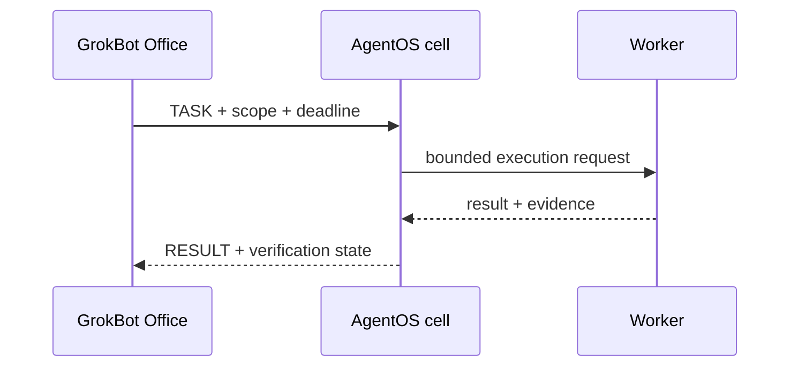

# A2A federation

A2A packets describe tasks and results between reviewed peers. They do not
grant trust.

Every packet should carry a task id, capability, data class, requester,
approval state, and evidence references. Reject credentials in packets. Use
separate accounts, credentials, permissions, and infrastructure for real
isolation. See [SECURITY.md](SECURITY.md).
