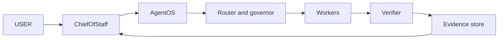

# Architecture

GrokBot Office is the persistent control layer around an external workforce.
It keeps intent, ownership, context, routing, approvals, and evidence legible
while workers remain replaceable.

## Boundaries

- GrokBot Office owns supervisory context and coordination policy.
- AgentOS owns provider-neutral execution, routing, recovery, and learning.
- Workers own bounded execution, not workforce policy.
- Verifiers own evidence, not self-approval.
- Human owners retain approval for consequential actions.

The diagrams and examples are architecture simulations unless a separately
recorded execution report says otherwise. See [OFFLINE.md](OFFLINE.md).
