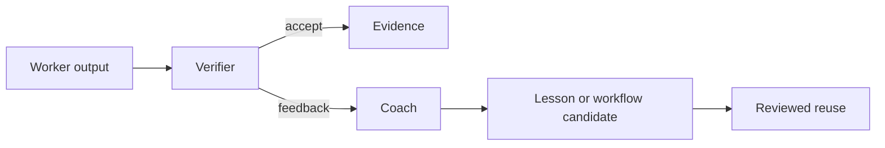

# Verification and coach

Verification is a separate evidence boundary. A worker does not certify its
own consequential output by assertion.

A coach records failure patterns, human corrections, recurring work, and
workflow maturity. It does not silently promote an assumption to a fact.

Verification records should include the verifier, confidence, evidence refs,
failure reason, and recommendation. See [WORKFLOWS.md](WORKFLOWS.md).
